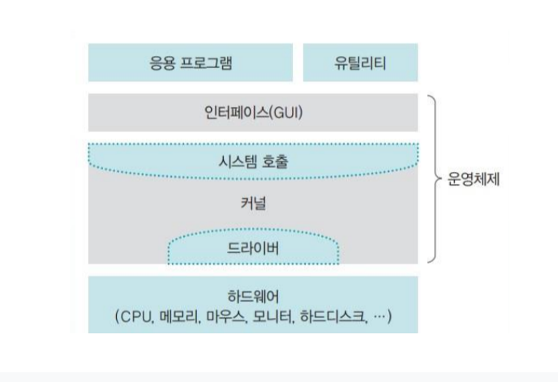
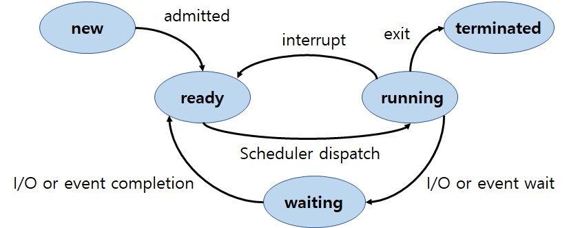
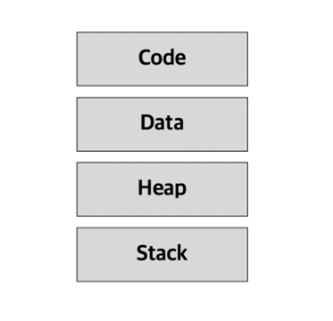

### **운영체제의 정의**

컴퓨터 하드웨어의 바로 위에 설치되어 사용자에게 편리한 인터페이스 환경을 제공하고 컴퓨터 시스템의 자원을 효율적으로 관리하는 소프트웨어

### **운영체제의 역할(목표)**

- **CPU 스케줄링과 프로세스 관리** : CPU 소유권을 어떤 프로세스에 할당할 지, 프로세스의 생성/삭제, 자원 할당/반환 관리
- **메모리 관리** : 한정된 메모리를 어떤 프로세스에 얼만큼 할당해야 하는지 관리
- **디스크 관리** : 디스크 파일을 어떠한 방법으로 보관할 지 관리
- **I/O 디바이스 관리** : I/O 장치간 데이터를 주고받는것을 관리

### **운영체제의 구조**

- GUI : 사용자 인터페이스로 사용자의 명령을 커널에 전달하고 실행결과를 알려줌
- 커널 : 프로세스 관리, 메모리 관리, 저장장치 관리와 같은 운영체제의 핵심적인 기능을 모아놓은것
- 시스템 콜 : 운영체제가 커널에 접근하기 위한 인터페이스
  - 커널이 자신을 보호하기 위해 만든 인터페이스. 사용자나 응용 프로그램이 자원에 직접 접근하지 못하게 막음으로서 시스템 자원을 사용하기 위해서는 시스템 호출이라는 인터페이스를 사용
  - 동작원리 : 유저프로그램이 I/O 요청으로 트랩(trap)을 발동시키면 올바른 I/O 요청인지 확인한 후 유저모드가 시스템 콜을 통해 커널 모드로 변환되어 실행된다.
- 드라이버 : 하드웨어를 제어하기 위한 소프트웨어

### 컴퓨터의 요소

컴퓨터는 CPU(중앙처리장치), RAM(메모리), 입력장치, 출력장치, 저장장치로 구성

- CPU : 명령어를 해석하여 실행하는 장치
- RAM : 작업에 필요한 프로그램과 데이터를 저장하는 장소. 바이트 단위로 분할되어 있으며, 분할 공간마다 주소로 구분됨

인터럽트에 의해 메모리에 존재하는 명령어를 해석하여 실행하는 장치

### CPU

- 산술,논리연산장치(ALU, Arithmetic and Logical Unit) : 데이터의 산술연산과 논리연산을 수행
- 제어장치(CU, Control Unit)
  - CPU에서 작업을 통제하고 지시. 기억 장치로 부터 명령을 순차적으로 꺼내 해독하고 해석에 따른 작업 지시
- 레지스터(Register)
  - CPU 내에 데이터를 임시로 보관하는 공간으로 메모리 계층의 최상위에 위치하며 가장 빠른 속도로 접근 가능

### 인터럽트

CPU가 입출력 관리자에게 입출력 명령을 보낸 후, 입출력 관리자는 명령받은 데이터를 메모리에 가져다 놓거나, 메모리에 있는 데이터를 저장장치로 옮기는데 이러한 처리가 완료되고 **입출력 관리자가 CPU에게 보내는 신호**

### DMA 컨트롤러

I/O 디바이스가 메모리에 직접 접근할 수 있도록 하는 하드웨어 장치

### 메모리

전자회로에서 데이터나 상태 명령어 등을 기록하는 장치

### 메모리 계층

상위 계층일수록 속도가 빠르며 용량이 작고 비싸기 때문에 계층을 두어 관리한다.

- 레지스터 : CPU 안에 있는 작은 메모리. 휘발성, 속도 가장 빠름, 기억용량 가장 작음
- 캐시 : L1, L2 캐시 지칭. 휘발성, 속도 빠름, 기억용량 작음
- 주 기억장치 : RAM. 휘발성, 속도 보통, 기억용량 보통
- 보조기억장치 : HDD, SSD. 비휘발성, 속도 낮음, 기억용량 많음

### 지역성(Locality)

기억장치내의 정보를 균일하게 Access하는것이 아닌 어느 한 순간에 특정 부분을 집중적으로 참조하는 성질이 있다는 이론

- 시간 지역성 : 최근에 사용한 데이터에 다시 접근하려는 특성
  - 최근에 참조된 주소의 내용은 곧 다음에 다시 참조되는 특성
- 공간 지역성 : 최근에 접근한 데이터와 가까운참조된 주소와 인접한 주소의 내용이 다시 참조되는 특성

### 캐시

- 데이터를 미리 복사해놓는 임시 보관소로 두 장치간의 속도 차에 따른 병목 현상을 줄이기 위한 메모리

**캐시히트와 캐시미스**

CPU가 필요로 하는 데이터를 RAM으로 찾으러 가기전에 캐시에서 데이터의 존재여부를 확인하는데 이때 캐시메모리에 해당 데이터가 있는경우를 캐시 히트, 없는 경우를 캐시 미스라고 함

**캐시 매핑(Cache Mapping)**

캐시는 RAM보다 용량이 작기 때문에 캐시 미스가 발생할 수 밖에 없는데 다음과 같은 캐시 메모리 사상기법을 통해 캐시 적중률(캐시히트)을 높임

- **직접 매핑(Direct Mapping)** : RAM을 일정한 크기의 블록으로 나누어 각각의 블록을 캐시의 정해진 위치에 매핑
- **연관 매핑(Associate Mapping)** : 캐시 메모리의 빈 공간에 마음대로 주소를 저장하는 방식
- **집합 연관 매핑(Set Associate Mapping)** : 직접 매핑과 연관 매핑을 결합한 방식으로 빈 공간에 마음대로 주소를 저장하되, 미리 정해준 특정 행에만 저장하는 방식

**웹브라우저의 캐시**

- 쿠키 : 만료기한이 있는 키-값 저장소
- 로컬스토리지 : 만료기한이 없는 키-값 저장소
- 세션스토리지 : 만료기한이 있는 키-값 저장소

\*\* 참고로 데이터 베이스 위에 레디스라는 데이터베이스를 캐싱계층으로 두기도 한다.

### 가상 메모리

컴퓨터가 실제로 이용가능한 메모리 자원을 추상화하여 큰 메모리로 보이게 하는 것

### 페이지 부재(Page fault)

프로세스가 페이지를 요청했을때 해당 페이지가 가상메모리에는 존재하지만 실제 주소에는 없는 상황. 이

### 스레싱 (Threshing)

프로세스의 원활한 수행에 요한 최소한의 page frame수를 할당받지 못해 페이지 부재로 작업이 멈춘것 같은 상태. 너무 많은 프로세스가 동시에 수행될 때 스레싱이 발생한다. 이를 해결할 수 있는 방법은 작업세트와 PFF가 있다.

### 프로세스

**프로그램**

- 저장장치에 저장되어 있는 정적인 상태로 파일시스템의 실행파일

**프로세스**

- 메모리 상에서 실행중인 프로그램.
- 프로그램이 운영체제로부터 PCB를 얻어 자신만의 고유공간과 자원을 할당받아 프로세스가 됨
- CPU 스케줄링의 대상이다.

### 프로세스의 상태

- **생성 상태** : 프로그램을 메모리에 가져와 실행 준비가 완료된 상태. 즉 프로세스가 생성된 상태
- **대기 상태** : 실행을 기다리는 모든 프로세스가 자기 차례를 기다리는 상태.
- **실행 상태** : CPU 소유권과 메모리를 할당받아 사용하는 상태
- **중단 상태** : 어떤 이벤트가 발생한 이후 기다리며 프로세스가 차단된 상태
- **완료 상태** : 메모리와 CPU 소유권을 모두 놓고 가는 상태. 정상 종료인 exit와 비정상 종료인 abort를 포함

### 프로세스 메모리구조

- 프로세스의 메모리 구조는 런타임 단계에서 메모리를 할당받는 정적영역과 컴파일단계에서 메모리를 할당받는 동적영역으로 이루어진다.
- **코드영역 :** 프로그램의 본문이 기술된 영역
- **데이터영역 :** 코드가 실행되면서 사용하는 변수나 파일 등의 각종 데이터를 모아놓은 곳
- **힙영역** : 동적으로 할당되는 변수를 담는 영역
- **스택영역 :** 함수가 호출될 때마다 함수 호출과 관련된 정보들이 저장되는 영역으로 변수의 스코프나 함수가 호출된 메모리 주소 등을 저장함.

### 프로세스 제어 블록 PCB(**Process Control Block)**

- 프로세스에 대한 메타데이터를 저장한 데이터
- 모든 프로세스는 고유의 프로세스 제어 블록을 가지며, 프로세스 제어 블록은 프로세스 생성 시 OS 커널에 의해 만들어지고, 프로세스가 실행을 완료하면 폐기됨.
- 프로세스의 중요한 정보를 담고 있기 때문에 커널모드에서만 접근 가능하며 일반 사용자가 접근하지 못하도록 커널스택의 가장 앞부분에서 관리된다.
- 아래의 정보들로 이루어져 있다
  - **프로세스 ID(Process ID)** : 프로세스 ID, 해당 프로세스의 자식 프로세스 ID
  - **프로세스 스케줄링 상태(Process state)** : '준비', '일시중단' 등 프로세스가 CPU에 대한 소유권을 얻은 이후의 상태
  - **프로세스 우선순위(Process Priority)** : 프로세스의 실행 순서를 결정하는 우선순위
  - **프로세스 권한** : 컴퓨터 자원 또는 I/O 디바이스에 대한 권한 정보
  - **프로그램 카운터(Program Counter)** : 프로세스에서 실행해야 할 다음 명령어의 주소에 대한 포인터
  - **CPU 레지스터(CPU Register)** : 프로세스를 실행하기 위해 저장해야 할 레지스터에 대한 정보
  - **CPU 스케줄링 정보** : CPU 스케줄러에 의해 중단된 시간 등에 대한 정보
  - **계정 정보(Accounting Information)** : 프로세스 실행에 사용된 CPU 사용량, 실행한 유저의 정보
  - **I/O 상태 정보** : 프로세스에 할당된 I/O 디바이스 목록

### 컨텍스트 스위칭(Context Switching)

- CPU를 차지하던 프로세스가 나가고 새로운 프로세스를 받아들이는 작업으로 **두 프로세스의 PCB를 교환**하는 작업
- 하나의 프로세스에 할당된 시간이 끝나거나, 인터럽트에 의해 발생
- 컨텍스트 스위칭은 스레드에서도 발생한다.

### 멀티프로세싱

- **멀티 프로세스**
  - 여러개의 프로세스가 각자 하나의 작업을 맡아 처리해 하나 이상의 일을 병렬로 처리할 수 있는 것
  - ex) 웹브라우저의 멀티프로세스 : 브라우저프로세스, 렌더러프로세스, 플러그인프로세스, GPU프로세스

### **프로세스 간 통신(Inter-Process Communication, IPC)**

- 프로세스들 사이에 서로 동시에 데이터를 주고받는 방식, 즉 프로세스간의 통신
- **메세지를 전달하는 방법**
  `message passing` : 커널을 통해 메세지 전달 (EX. 파이프, 메세지큐, 소켓)
- **주소공간을 공유하는 방법**
  `shared memory` : 서로 다른 프로세스간에도 일부 주소공간을 공유하게 하는 shared memory 매커니즘이 있음

### **스레드**

- 프로세스 내부의 실행 단위. 하나의 프로세스는 여러 스레드를 가질 수 있다.
- 스레드는 프로세스와 달리 다른 스레드와 공간과 자원(코드, 데이터, 힙)을 공유하며 사용한다.
  - 모든 스레드가 자원을 공유하기 때문에 하나의 스레드에 문제가 생기면 프로세스에 영향을 미침
  - 임계영역에 동시에 접근하는 경우 다른스레드가 사용중인 변수나 자료구조에 접근하여 엉뚱한 값을 읽어오기도 함
- 멀티스레딩 : 단일 프로세스의 컨텍스트 내에서 여러 스레드를 동시에 실행하는 기법

### 공유자원

- 여러 프로세스/스레드가 함께 접근할 수 있는 변수, 메모리, 파일, 데이터 등의 자원
- 공유 자원에 대해 여러 개의 프로세스가 동시에 접근을 시도할 때 접근의 타이밍이나 순서 등이 결과값에 영향을 줄 수 있는 상태를 경쟁 조건이라고 한다.

### 임계영역

- 2개 이상의 프로세스/스레드가 공유 자원에 접근해서 실행 결과가 달라지게 될 수 있는 코드영역
- 임계영역 해결 충족조건
  - **상호 배제 :** 한 프로세스가 임계영역에 들어가면 다른 프로세스는 임계영역에 들어갈 수 없음
  - **한정 대기 :** 특정 프로세스가 영원히 임계영역에 들어가지 못하면 안된다.
  - **융통성 :** 한 프로세스가 다른 프로세스의 일을 방해해서는 안됨
- 임계영역 해결 방법
  - 임계영역 해결 방법에는 크게 뮤택스, 세마포어, 모니터 세가지가 있으며 이 방법들에 토대가 되는 매커니즘은 lock이다.
  - **뮤택스(Mutex)**
    - 프로세나 스레드가 공유자원을 lock을 통해 잠금 설정하고 사용한 후에는 unlock을 통해 잠금 해제하는 객체
    - 이 객체를 소유해야만 공유자원에 접근가능하다.
  - **세마포어(Semaphores)**
    - 일반화된 뮤텍스로 간단한 정수값과 P, V 두가지 함수로 공유자원에 대한 접근을 처리하는 방법
    - 0과 1의 값만 가질 수 있는 바이너리 세마포어와 여러개의 값을 가질 수 있는 카운팅 세마포어로 나뉘어진다.
  - **모니터(Monitor)**
    - 둘 이상의 스레드나 프로세스가 공유자원에 안전하게 접근할 수 있도록 공유자원을 숨기고 해당 접근에 대해 인터페이스만 제공하는 것
    - 세마포어 알고리즘을 자동으로 관리하는 기법

### 교착상태(Deadlock)

- 2개 이상의 프로세스가 다른 프로세스의 작업이 끝나기만 기다리며 작업을 더 이상 진행하지 못하는 상태
- **교착 상태의 원인(필요조건)**
  - **상호 배제 :** 한 프로세스가 자원을 독점하고 있으며 다른 프로세스는 접근이 불가능함
  - **점유와 대기** : 특정 프로세스가 점유한 자원을 다른 프로세스가 요청하는 상태
  - **원형 대기** : 점유와 대기를 하는 프로세스 간에 사이클이 형성되어야함
  - **비선점 :** 한 프로세스가 사용 중인 자원은 다른 프로세스가 강제로 뺏어올 수 없는 비선점 자원이어야 함
- **교착상태의 해결방법**
  - **교착 상태 예방 :** 자원을 할당할 때 교착상태를 유발하는 4가지 필요조건이 성립되지 않도록 함
  - **교착 상태 회피 :** 교착상태 가능성이 없을 때만 자원을 할당하여 교착 상태를 회피함
    - **은행원 알고리즘 :** 프로세스 시작시 해당 프로세스가 총 자원의 양과 현재 할당한 자원의 양을 기준으로 안정/불안정 상태를 나누어 시스템이 안정 상태를 유지하도록 자원을 할당하는 알고리즘
  - **교착 상태 검출 :** 타임아웃이나 자원할당 그래프를 사용하여 교착상태를 검출함
  - **교착 상태 회복 :** 교착 상태가 검출되면 교착 상태를 유발한 프로세스를 강제로 종료
