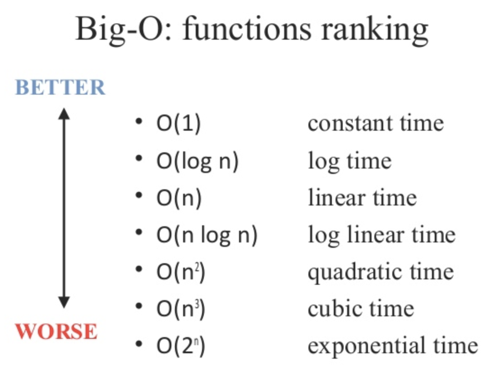
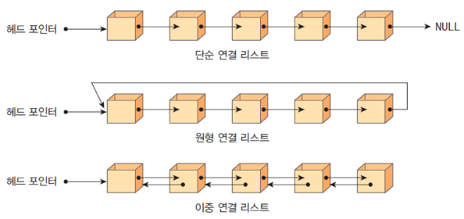

### 복잡도

- **알고리즘의 성능을 나타내는 척도**로 시간복잡도와 공간복잡도로 나뉘어진다.
- 복잡도가 낮을수록 좋은 알고리즘이다.

### 빅오(Big-O) 표기법

가장 빠르게 증가하는 항만 고려하는 표기법으로 함수의 상한만을 나타내는 표기법

### 시간 복잡도

- 알고리즘을 수행하는 데 연산들이 몇 번 이루어지는 지를 나타내는 숫자

- 많이 다루어 지는 시간 복잡도
  | 상수 시간 - O(1) | 정수의 홀/짝 여부 판별, 배열 요소 접근 |
  | --- | --- |
  | 로그 시간 - O(logN) | 이진 탐색 |
  | 선형 시간 - O(N) | 정렬되지 않은 자료 구조에서 특정 원소 탐색 |
  | 선형 로그 시간 - O(NlogN) | 병합 정렬, 힙 정렬, 고속 푸리에 변환 |
  | 이차(또는 제곱) 시간 - O(N²) | 버블 정렬, 삽입 정렬 |
  | 지수 시간 - O(2ⁿ) | 조합(Combination) |
- 시간 제한이 1초 일때 알고리즘 설계
  - N의 범위가 500인 경우 : 시간 복잡도가 `O(N^3)`인 알고리즘 설계
  - N의 범위가 2,000인 경우 : 시간 복잡도가 `O(N^2)`인 알고리즘 설계
  - N의 범위가 100,000인 경우 : 시간 복잡도가 `O(NlogN)`인 알고리즘 설계
  - N의 범위가 10,000,000인 경우 : 시간 복잡도가 `O(N)`인 알고리즘 설계
  - N의 범위가 10,000,000,000인 경우: 시간 복잡도가 `O(logN)` 이하인 알고리즘을 설계

### 공간 복잡도

- 프로그램을 실행시킨 후 완료하는 데 필요로 하는 자원 공간의 양
- 메모리 제한에 따른 알고리즘 설계
  - `int a[1,000]` : 4KB
  - `int a[1,000,000]` : 4MB
  - `int a[2,000][2,000]` : 16MB

### 자료구조 별 시간 복잡도

| 자료구조         | 접근    | 탐색    | 삽입    | 삭제    |
| ---------------- | ------- | ------- | ------- | ------- |
| 배열             | O(1)    | O(n)    | O(n)    | O(n)    |
| 스택             | O(n)    | O(n)    | O(1)    | O(1)    |
| 큐               | O(n)    | O(n)    | O(1)    | O(1)    |
| 이중 연결 리스트 | O(n)    | O(n)    | O(1)    | O(1)    |
| 해시 테이블      | O(1)    | O(1)    | O(1)    | O(1)    |
| 이진 탐색 트리   | O(logN) | O(logN) | O(logN) | O(logN) |
| AVL 트리         | O(logN) | O(logN) | O(logN) | O(logN) |
| 레드 블랙 트리   | O(logN) | O(logN) | O(logN) | O(logN) |

### 자료구조

- 데이터를 효율적으로 표현, 관리, 처리하기 위한 데이터 구조
- 자료구조는 크게 선형 자료구조와 비선형 자료구조로 구분된다.
- 선형 자료구조
  - 각 요소가 일렬로 나열되어 있는 자료구조
  - 종류 : `Linked List`, `Array`, `Stack`, `Queue`
- 비선형 자료구조
  - 각 요소가 연결되어 있지 않고 주로 계층적이거나 네트워크 형태로 배치되는 자료구조
  - 종류 : `Graph`, `Tree`, `Heap`, `Priority Queue`, `Map`, `Set`, `Hash`

### 연결리스트

- 데이터를 감싼 노드를 포인터로 연결해 공간적으로 효율적인 자료구조
- 구분
  - 싱글 연결 리스트 : `next` 포인터만 가지는 연결리스트
  - 이중 연결 리스트 : `prev`, `next` 포인터를 가지는 연결리스트
  - 원형 이중 연결 리스트 : 이중 연결 리스트의 마지막 노드 `tail`의 `next` 포인터가 첫 노드의 `head` 노드를 가르켜 순환 구조를 가지는 연결리스트

### 배열

- 크기가 정해져 있으며 같은 타입의 값을 연속적인 형태(밀집배열)
- js에서의 배열은 여러개의 값을 연속적인 형태로 나열한 자료구조로 일반적인 배열의 동작을 흉내낸 특수한 객체이다.(희소배열)
- 다른 언어에서는 벡터라는 동적 배열을 사용
- 접근 방식
  - 직접 접근(랜덤접근)
    - 순차적인 데이터에서 어떤 인덱스에 위치하든 동일한 시간내에 접근
    - ex) 배열
  - 순차적 접근
    - 데이터를 처음부터 저장된 순서대로 탐색하여 접근
    - 특정 요소에 도달하기 위해 이전 요소를 모두 거쳐야 함
    - ex) 연결리스트
  - 탐색은 랜덤접근(배열)이 빠르고 추가는 순차적접근(연결리스트)이 빠르다.

### 스택(FILO)

- 데이터의 삽입과 삭제가 데이터의 한쪽 끝에서만 일어나는 자료구조
- 선입 후출 구조이며 재귀함수나 웹브라우저 방문 기록등에 사용됨

### 큐(FIFO)

- 데이터의 양방향에서 삽입과 삭제가 일어나는 자료구조를 의미
- 선입 선출 구조이며 CPU 준비큐, 스레드 행렬, BFS, 캐시 등에서 사용됨
